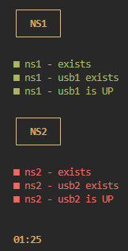

# rlgl - Red light, Green light

Red light, Green Light, or rlgl in short, is a simple status monitor written in bash. Use it to monitor anything that can evaluate into a bash boolean expression.

## Basic usage

Use config.yaml to list bash commands that evaluate to true or false (auto reloads on changes while running)

```yaml
- title: "NS1"
  checks:
    - name: "ns1 - exists"
      command: "ip netns list | grep -q '^ns1'"
    - name: "ns1 - usb1 exists"
      command: "ip netns exec ns1 ip addr show 2>/dev/null | grep -q usb1"
    - name: "ns1 - usb1 is UP"
      command: "ip netns exec ns1 ip addr show 2>/dev/null | grep usb1 | grep -q 'state UP'"
- title: "NS2"
  checks:
    - name: "ns2 - exists"
      command: "ip netns list | grep -q '^ns2'"
    - name: "ns2 - usb2 exists"
      command: "ip netns exec ns2 ip addr show 2>/dev/null | grep -q usb2"
    - name: "ns2 - usb2 is UP"
      command: "ip netns exec ns2 ip addr show 2>/dev/null | grep usb2 | grep -q 'state UP'"
```

Next run

`./rlgl.sh`

or in the above example with network namespaces

`sudo ./rlgl.sh`

since it needs to run `ip netns exec`.

and rlgl will show the current status.



A timer exists to make sure that the screen is not frozen.

## Specifying another config file

The script can be started with different config files using the `-c` or `--config` option.

## Setting polling intervals

The polling intervals can be set globally in the `config.yaml` file or overridden for individual checks. The global polling interval is defined at the top of the configuration file, while each check can specify its own interval using the `poll_interval` key.

```yaml
global_poll_interval: 10  # Global polling interval in seconds

- title: "NS1"
  checks:
    - name: "ns1 - exists"
      command: "ip netns list | grep -q '^ns1'"
      poll_interval: 5  # This check will run every 5 seconds
    - name: "ns1 - usb1 exists"
      command: "ip netns exec ns1 ip addr show 2>/dev/null | grep -q usb1"
      poll_interval: 3.5  # You can even use decimal values
    - name: "ns1 - usb1 is UP"
      command: "ip netns exec ns1 ip addr show 2>/dev/null | grep usb1 | grep -q 'state UP'"
```

## Todo

- ~~Add the functionality to start the script with different config files.~~
- Add the functionality to set different polling intervals, both globally and per check.
- ~~Rename everything to rlgl - Red light/green light, since this is the actual name of the game :p~~
