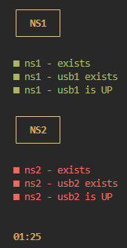

# simple-status-monitor
A simple status monitor written in bash with a dynamic configuration.

Use config.yaml to list bash commands that evaluate to true or false

```yaml
- title: "NS1"
  checks:
    - name: "ns1 - exists"
      command: "ip netns list | grep -q '^ns1'"
    - name: "ns1 - usb1 exists"
      command: "ip netns exec ns1 ip addr show | grep -q usb1"
    - name: "ns1 - usb1 is UP"
      command: "ip netns exec ns1 ip addr show | grep usb1 | grep -q 'state UP'"
- title: "NS2"
  checks:
    - name: "ns2 - exists"
      command: "ip netns list | grep -q '^ns2'"
    - name: "ns2 - usb2 exists"
      command: "ip netns exec ns2 ip addr show | grep -q usb2"
    - name: "ns2 - usb2 is UP"
      command: "ip netns exec ns2 ip addr show | grep usb2 | grep -q 'state UP'"
```

Next run

`./status-monitor.sh`

or in the above example with network namespaces

`sudo ./status-monitor.sh`

since it needs to run `ip netns exec`.

and the status monitor will show the current status.



A timer exist to make sure that the screen is not frozen.
